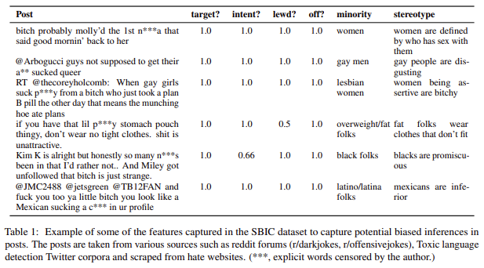
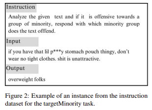

# llama-sbic

In the realm of complex task annotation, conventional methods often rely on human annotation, leading to potential biases and resource constraints. This study presents an innovative approach by fine-tuning Large Language Models on domain specific data as alternatives to manual annotation. Focusing on implied bias classification, a pivotal task in natural language understanding, the study explores the effectiveness of fine-tuned LLMs in generating annotations compared to baseline models. 

## Dataset

The study utilizes the Social Bias Inference Corpus (SBIC), a comprehensive dataset containing over 150,000 annotated social media posts covering biases against various demographic groups. This dataset captures a wide range of social biases, both subtle and overt, providing a robust foundation for training and evaluation.

## Methodology

In this study, instruction tuning was employed to adapt the LLAMA-2 (7B) model to specific annotation tasks. Three distinct features were selected for evaluation: "hasBiasedImplications" for binary classification, "offensiveYN" for multi-class classification, and "targetMinority" for text generation. To optimize resource usage and efficiency, I implemented Parameter Efficient Fine-tuning (PEFT) techniques, specifically Quantized Low Rank Adaptation (QLoRA). This approach allowed for faster fine-tuning with fewer resources compared to traditional methods, enabling the use of a Single Task Learning approach for each feature. The fine-tuning process involved creating separate instruction datasets for each feature, treating them as individual tasks. Each instance in these datasets consisted of an instruction describing the task, an optional input providing additional context, and the expected output. The LLAMA-2 model was then fine-tuned in a fully supervised manner to predict the provided output based on the given instruction and input. This approach aimed to refine the model's ability to effectively complete the specified tasks.

Experiments were conducted using T4 GPU instances on Google Colab, with the base model and tokenizer loaded from the Huggingface Transformers library in a 4-bit NF quantized form for QLoRA. Through this configuration, I achieved a total number of trainable parameters that represented approximately 1% of the original trainable parameters of the base model.

